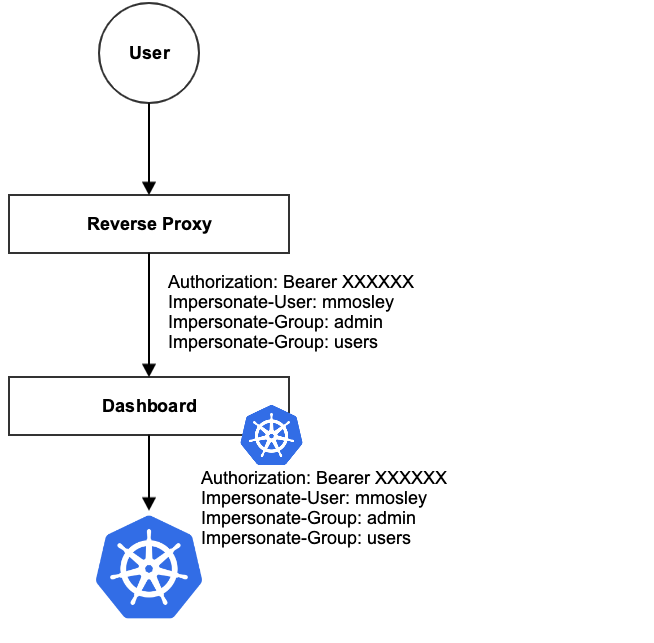

# User guide

* [Installation](installation.md)
* [Certificate management](certificate-management.md)
* [Accessing Dashboard](accessing-dashboard/README.md)
  * [1.7.x and above](accessing-dashboard/1.7.x-and-above.md)
  * [1.6.x and below](accessing-dashboard/1.6.x-and-below.md)
* [Access control](access-control/README.md)
  * [Creating sample user](access-control/creating-sample-user.md)
* [Integrations](integrations.md)
* [Labels](labels.md)

## User Impersonation

Impersonation uses a reverse proxy to inject a user's identifying information (username, groups and extra scopes) as headers in each request to the API server. The Dashboard can pass these headers to the API server if your reverse proxy will inject them in the requests.

Impersonation is useful in situations where using a user's token isn't available, such as cloud-hosted Kubernetes services.  To use impersonation a reverse proxy must:

1. Have a Kubernetes service account that [has RBAC permissions to impersonate other users](https://kubernetes.io/docs/reference/access-authn-authz/authentication/#user-impersonation)
2. Generate the `Impersonate-User` header with a unique name identifying the user
3. *Optional* Generate the `Impersonate-Group` header(s) with the impersonated user's group data
4. *Optional* Generate the `Impersonate-Extra` header(s) with additional authorization data

Impersonation will only work when the reverse proxy provides the `Authorization` header with a valid service account.  It will not work with any other method of authenticating to the dashboard.

----
_Copyright 2019 [The Kubernetes Dashboard Authors](https://github.com/kubernetes/dashboard/graphs/contributors)_
